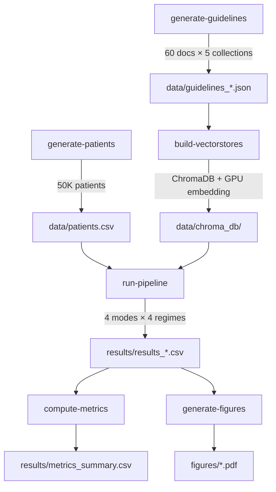

# ClinicalShift

**Temporal Robustness of Stateful Multi-Agent LLM Architectures Under Clinical Dataset Shift**

Companion code for the DAIH 2026 paper. Evaluates whether multi-agent architectures with safety-floor verification loops retain guideline compliance when clinical knowledge bases undergo temporal and institutional shifts.

---

## Key Result

Under institutional vocabulary shift (cosine similarity drop of 0.36), the linear RAG pipeline's Guideline Compliance Score drops to **0.36** while the stateful graph architecture maintains **1.00** through its safety-floor mechanism.

---

## Architecture



---

## Experiment Matrix (4 modes × 4 regimes)

| Mode | Description | RAG | Audit | Safety Loop |
| ------ | ------------- | ----- | ------- | ------------- |
| `single` | LLM only — no retrieval, no safety | ❌ | ❌ | ❌ |
| `naive_rag` | Static baseline KB regardless of shift | ✅ | Post-hoc | ❌ |
| `linear` | Shift-aware RAG, audit for eval only | ✅ | Post-hoc | ❌ |
| `graph` | Full safety floor with iterative correction | ✅ | ✅ | ✅ |

| Regime | Mechanism |
| -------- | ----------- |
| `baseline_tau_old` | Unperturbed 2025 guidelines |
| `temporal_drift_tau_new` | eGFR threshold raised 30→45, 30% docs modified |
| `institution_swap_instB` | Vocabulary transformation (11 term pairs) |
| `schema_erasure` | Metadata stripped, pure text retrieval |

---

## Quick Start

### Prerequisites

- Python 3.11+
- [uv](https://docs.astral.sh/uv/) package manager
- [Ollama](https://ollama.ai) with `llama3:latest` pulled
- ~36GB RAM (Apple M3 Pro or equivalent)

### Setup

```bash
git clone https://github.com/behordeun/clinicalshift.git
cd clinicalshift
uv sync
cp .env.example .env
ollama pull llama3:latest
```

### Run

```bash
make all    # Full pipeline: data → vectorstores → verify → run → metrics
make smoke  # Quick test: 10 patients × all conditions (~10 min)
```

---

## Metrics

| Metric | What it measures |
| -------- | ----------------- |
| **SFI** | BERTScore F1 — semantic similarity to ground-truth summary |
| **FCCR** | Per-patient fraction of contradictions detected by auditor |
| **GCS** | Guideline Compliance Score — does the output acknowledge contraindications? |
| **TCA** | Temporal Calibration Agreement — verbalized confidence vs actual epoch-alignment |

---

## Project Structure

```text
clinicalshift/
├── pyproject.toml               # Dependencies + entry points (uv-managed)
├── Makefile                     # make all | smoke | run | metrics | clean
├── .env.example                 # Ollama configuration template
├── src/clinicalshift/
│   ├── __init__.py              # Version + GPU device detection
│   ├── generate_patients.py    # 50K synthetic T2DM+CKD+HTN cohort
│   ├── generate_guidelines.py  # 60 clinical guidelines × 5 collections
│   ├── build_vectorstores.py   # ChromaDB with hash-based rebuild skip
│   ├── run_pipeline.py         # 4 modes, parallel workers, checkpoint/resume
│   ├── compute_metrics.py      # SFI, FCCR, GCS, TCA, bootstrap CIs
│   └── generate_figures.py     # Publication-quality matplotlib figures
├── docs/
│   ├── archives/
│   │   └── manuscript.tex      # Paper (LaTeX)
│   └── PROBLEM_UNDERSTANDING.md
├── figures/                     # Generated PDF/PNG figures
├── data/.gitkeep               # Generated data (gitignored)
└── results/.gitkeep            # Experiment outputs (gitignored)
```

---

## Configuration

| Variable | Location | Default |
| ---------- | ---------- | --------- |
| `OLLAMA_BASE_URL` | `.env` | `http://localhost:11434` |
| `OLLAMA_MODEL` | `.env` | `llama3:latest` |
| `EMBED_MODEL` | `.env` | `sentence-transformers/all-MiniLM-L6-v2` |
| `N_FULL` | `Makefile` | `500` |
| `WORKERS` | `Makefile` | `3` |

---

## Reproducibility

The entire experiment — data generation, vectorstore construction, multi-agent inference across 15 conditions, and metric computation — runs on a single Apple M3 Pro with no external API calls:

```bash
make all
```

Results appear in `results/metrics_summary.csv`. Figures in `figures/`.

---

## Citation

```bibtex
@inproceedings{sulaiman2026clinicalshift,
  title={Temporal Robustness of Stateful Multi-Agent LLM Architectures Under Clinical Dataset Shift},
  author={Sulaiman, Muhammad Abiodun and Oyeyemi, Bolaji Fatai},
  booktitle={Proceedings of DAIH 2026},
  year={2026}
}
```

---

## License

MIT License. See [LICENSE](LICENSE) for details.
