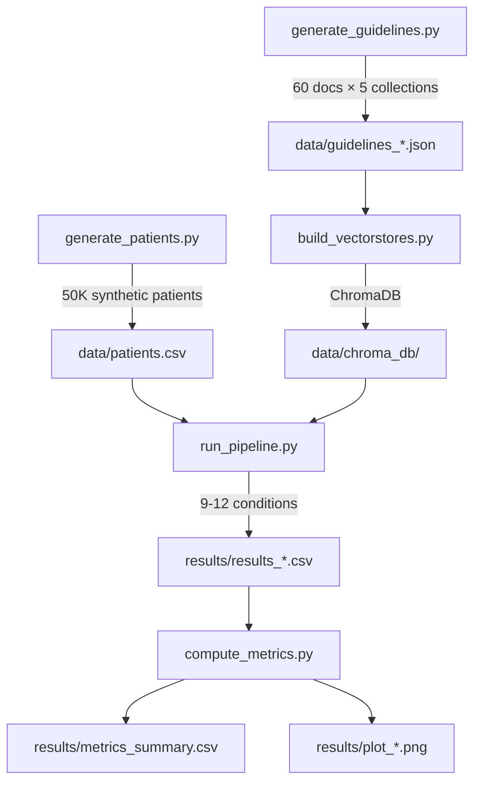
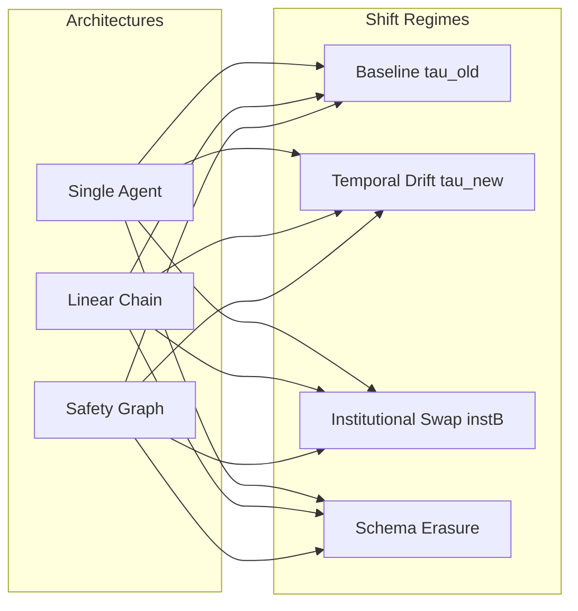
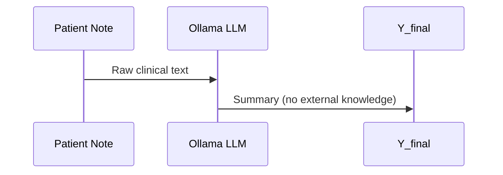
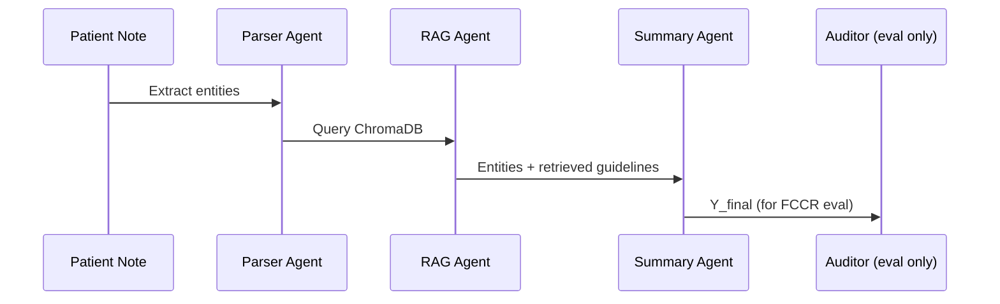
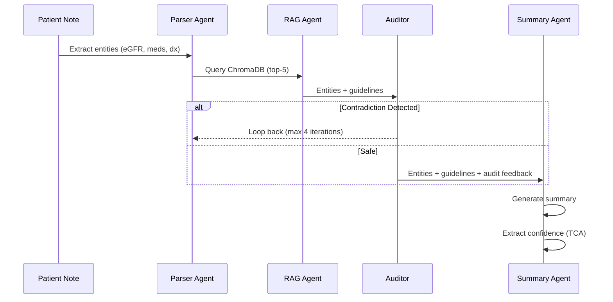
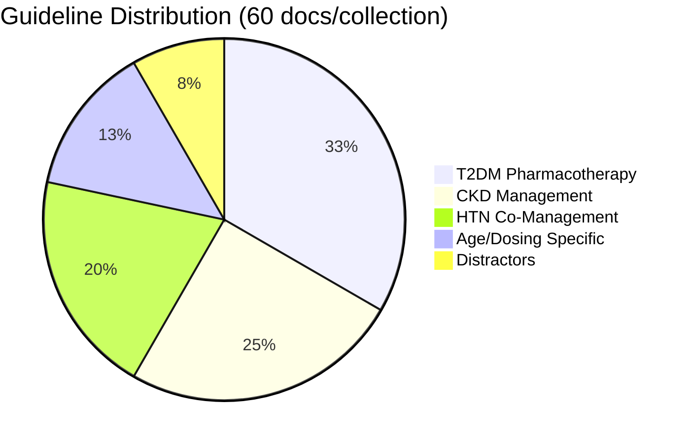
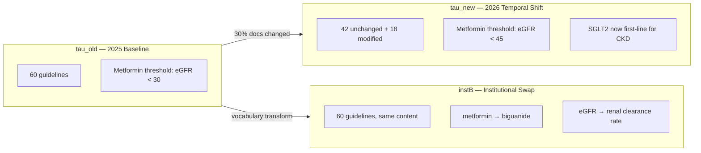

# ClinicalShift-2026

**Evaluating Temporal Robustness of Multi-Agent LLM Architectures Under Clinical Dataset Shift**

A reproducible experimental pipeline for the DAIH 2026 paper submission. Measures how stateful, heterogeneous multi-agent orchestration graphs withstand temporal and institutional knowledge shifts in clinical environments.

---

## Architecture Overview



---

## Experimental Design

### The 3×4 Experiment Matrix



| Mode | Description | RAG | Audit | Safety Loop |
| ------ | ------------- | ----- | ------- | ------------- |
| `single` | LLM only — no retrieval, no safety checks | ❌ | ❌ | ❌ |
| `linear` | Parse → RAG → Summary (audit for eval only) | ✅ | Post-hoc | ❌ |
| `graph` | Parse → RAG → Audit → (Loop) → Summary | ✅ | ✅ | ✅ |

### Shift Regimes

| Regime | Mechanism | Key Change |
| -------- | ----------- | ------------ |
| `baseline_tau_old` | No shift — 2025 guidelines | Metformin contraindicated if eGFR < 30 |
| `temporal_drift_tau_new` | Threshold raised | Metformin contraindicated if eGFR < **45** |
| `institution_swap_instB` | Vocabulary transformation | "metformin" → "biguanide", "eGFR" → "renal clearance" |
| `schema_erasure` | Metadata stripped | No tags/epoch/institution — pure text retrieval |

---

## Pipeline Modes — Detailed Flow

### Single Agent Mode



### Linear Multi-Agent Mode



### Safety Graph Mode



---

## Metrics

| Metric | Definition | Range |
| -------- | ----------- | ------- |
| **SFI** (Semantic Fidelity Index) | BERTScore F1 between `Y_final` and ground-truth `Y_star` | 0–1 (higher = better) |
| **FCCR** (Fact-Checking Coverage Ratio) | Fraction of ground-truth contradictions detected by auditor | 0–1 (higher = better) |
| **TCA** (Temporal Calibration Agreement) | Calibration between verbalized confidence and epoch-alignment | 0–1 (1 = perfect calibration) |
| **Γ** (Cascading Error Amplification) | Ratio of downstream to upstream semantic error | <1 = errors absorbed, >1 = errors amplified |

---

## Quick Start

### Prerequisites

- Python 3.11+
- [uv](https://docs.astral.sh/uv/) package manager
- [Ollama](https://ollama.ai) running locally with `llama3:latest` pulled
- ~36GB RAM recommended (M3 Pro or equivalent)

### Setup

```bash
# Clone and enter
cd clinicalshift-2026

# Install all dependencies (uv-managed, editable package)
uv sync

# Configure Ollama endpoint
cp .env.example .env  # then verify port 11434

# Pull required model
ollama pull llama3:latest
```

### Run Everything

```bash
# Full reproducible pipeline (install → data → vectorstores → verify → run → metrics)
make all

# Or step by step:
make install       # uv sync — install all dependencies
make data          # Generate 50K patients + 60-doc guideline collections
make vectorstores  # Build ChromaDB vector stores (5 collections, GPU-accelerated)
make verify        # Validate retrieval quality
make smoke         # Quick test: 10 patients × all conditions (~10 min)
make run           # Full run: 2000 patients × all conditions (~14h with 2 workers)
make metrics       # Compute SFI, FCCR, TCA + generate plots (GPU-accelerated)
```

### Configuration

| Variable | Location | Default | Purpose |
| ---------- | ---------- | --------- | --------- |
| `OLLAMA_BASE_URL` | `.env` | `http://localhost:11434` | Ollama API endpoint |
| `OLLAMA_MODEL` | `.env` | `llama3:latest` | LLM for summary generation |
| `EMBED_MODEL` | `.env` | `sentence-transformers/all-MiniLM-L6-v2` | Embedding model for RAG |
| `N_FULL` | `Makefile` | `2000` | Patients per condition for full run |
| `SEED` | `Makefile` | `42` | Reproducibility seed |

---

## Project Structure

```text
clinicalshift-2026/
├── pyproject.toml               # Project metadata, deps, entry points (uv-managed)
├── uv.lock                      # Locked dependency versions
├── .env.example                 # Environment variable template
├── .env                         # Local config (gitignored)
├── .python-version              # Python version pin (3.11)
├── Makefile                     # Orchestration targets
├── README.md
├── PROBLEM_UNDERSTANDING.md     # Design decisions and rationale
├── manuscript_draft_1.tex       # Paper draft
│
├── src/clinicalshift/           # Python package
│   ├── __init__.py              # Version + shared GPU device detection
│   ├── generate_patients.py    # Synthetic patient cohort (50K)
│   ├── generate_guidelines.py  # Clinical guideline collections (60 docs × 5)
│   ├── build_vectorstores.py   # ChromaDB embedding + indexing (GPU-accelerated)
│   ├── run_pipeline.py         # Experiment runner (3 modes × 4 regimes)
│   └── compute_metrics.py      # SFI, FCCR, TCA, CIs, plots (GPU-accelerated)
│
├── data/                        # Generated artifacts (gitignored except .gitkeep)
│   ├── .gitkeep
│   ├── patients.csv
│   ├── guidelines_*.json
│   └── chroma_db/
│
└── results/                     # Experiment outputs (gitignored except .gitkeep)
    ├── .gitkeep
    ├── results_*.csv
    ├── metrics_summary.csv
    └── plot_*.png
```

---

## Knowledge Base Design



### Shift Mechanics



---

## Checkpoint & Resume

Long-running experiments (~14h) support crash recovery:

- Results are written incrementally (one row per patient)
- On restart, already-processed patient IDs are skipped
- No duplicate rows, no lost progress

```bash
# If interrupted, simply re-run the same command:
make run  # Picks up where it left off
```

---

## Reproducing Paper Results

```bash
# 1. Generate all data
make data vectorstores

# 2. Verify experimental mechanism works
make verify

# 3. Run Phase 1 (rule-based parser, all conditions)
make run  # ~14h with parallel Ollama on M3 Pro

# 4. Compute metrics and generate figures
make metrics

# 5. Results appear in:
#    results/metrics_summary.csv  — Table 1 numbers
#    results/plot_sfi_by_regime.png — Figure 2
#    results/plot_fccr_overall.png — Figure 3
```

---

## Hardware Requirements

| Component | Minimum | Recommended |
| ----------- | --------- | ------------- |
| RAM | 16GB | 36GB (for parallel Ollama) |
| CPU | 8 cores | 12+ cores |
| GPU | None (CPU inference works) | Apple M-series / NVIDIA (for BERTScore on MPS/CUDA) |
| Storage | 5GB | 10GB |
| Ollama model | llama3:8b (4.7GB) | + gemma4:12b for ablations |

---

## License

Research use only. See paper for citation.
